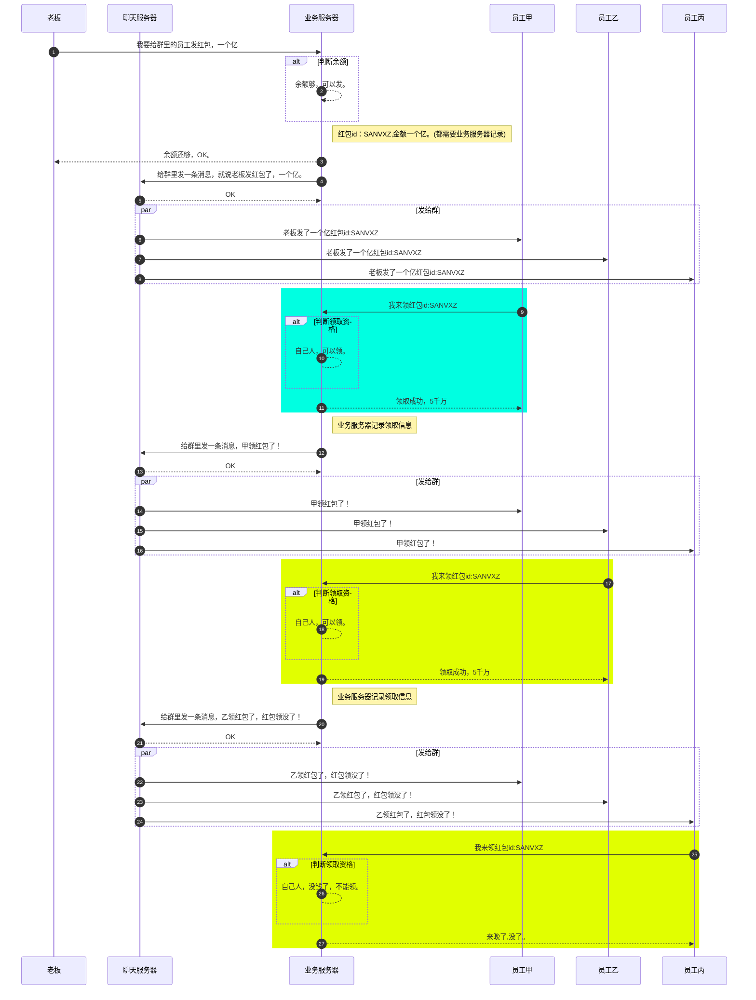

# 红包方案

1. 用户A充钱到业务服务器，换取红包额度；
2. 用户发A送红包;
   1. 客户端调用业务服务器发送红包接口，并提交红包金额，数量，接收人(群)id；
   2. 业务服务器验证剩余额度是否满足发送额度；
      1. 不满足，返回失败结果给A；
      2. 满足，服务器根据A提交信息，调用环信rest接口，发送红包自定义消息给对应接收人，并记录红包id，同时将id返回给A，A将消息插入到环信db，并显示到ui界面；
3. 接收方(群)收到红包自定义消息；
4. 接收方B点击红包消息，显示红包信息和领取(抢红包)按钮；
   1. 接收方B点击领取(抢红包)按钮;
   2. B调用业务服务器接口，将红包id信息提交到业务服务器；
      1. 业务服务器判断红包是否剩余足够额度，判断B是否有资格领取；
         1. 额度不足或者B无资格领取，返回“已领完”或者“无资格领取”；
         2. 额度足够且B有资格领取，返回领取金额，并计算红包余额，记录B已领取操作(根据业务，可以记录领取时间等信息)，业务服务器调用环信rest接口，向A(红包所在群)发送B领取红包。
5. A点击红包消息，根据红包id查询余额以及领取情况；
6. B点击红包消息，根据红包id查询自己领取情况；

